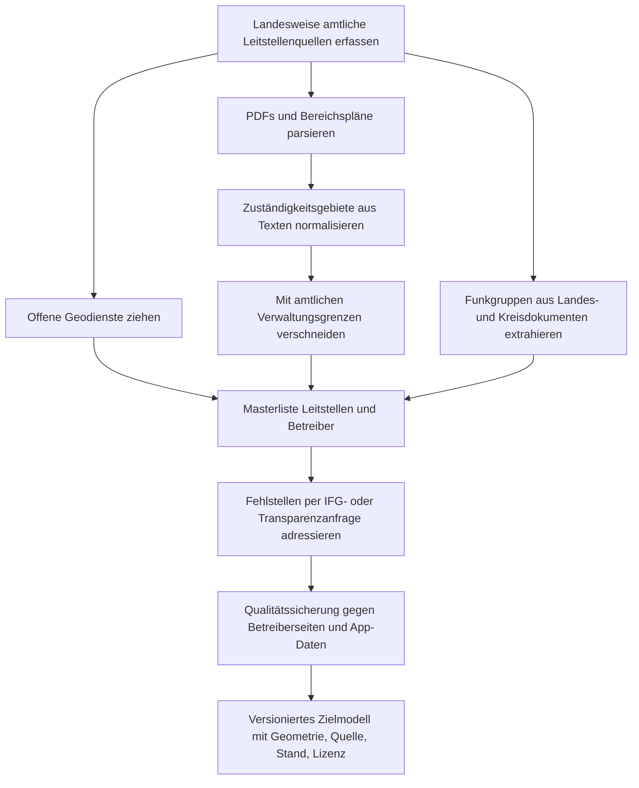

# Recherche zum bundesweiten Verzeichnis integrierter Leitstellen in Deutschland

## Executive Summary

Ein einzelnes, öffentlich zugängliches, amtliches **Bundesverzeichnis aller integrierten Leitstellen in Deutschland inklusive Funkgruppen und Kartengrenzen** habe ich nicht gefunden. Die belastbaren Quellen liegen überwiegend **dezentral auf Landesebene** oder noch tiefer bei Zweckverbänden, Landkreisen, Städten, Betreiberorganisationen und Digitalfunk-Stellen. Genau deshalb wirkt das Datenmodell hinter „BOS Funk Deutschland“ praktisch wie ein Sonderfall: Die App behauptet selbst, für **jeden Leitstellenbereich in ganz Deutschland** analoge Kanäle und digitale TETRA-Rufgruppen samt Kurzwahlen bereitzuhalten, bleibt aber ein **geschlossenes Produkt ohne offenen Dump oder dokumentierte offene API**. citeturn32view0turn32view1turn40view0turn45view0turn51view0

Die derzeit wichtigste amtliche Ausnahme bei den **Kartengrenzen** ist entity["state","Bayern","germany"]: Dort gibt es mit den Datensätzen **„Integrierte Leitstellen (Flächen)”** und **„IntegrierteLeitstellenFlaeche”** tatsächlich offizielle, maschinenlesbare Geodaten samt WFS-Zugang. In entity["state","Nordrhein-Westfalen","germany"] gibt es immerhin ein offenes Leitstellenverzeichnis per OGC API Features und CSV, aber keine öffentlich dokumentierten Flächen der Leitstellenbereiche. In entity["state","Sachsen","germany"] und entity["state","Brandenburg","germany"] existieren weitere offene Rettungsdienst-Geodaten, allerdings meist als Trägerbereiche, Rettungswachen- oder Rettungsmittel-Daten und nicht als bundesweit harmonisierte ILS-Grenzen. citeturn46view0turn43search0turn45view0turn35view0turn54view0turn53search5

Bei den **Funkgruppen** ist die Lage noch fragmentierter. Öffentliche Listen und Kennungen gibt es durchaus, etwa im **Digitalfunkatlas Baden-Württemberg**, in Nutzungskonzepten aus NRW oder Lehrunterlagen aus Hessen. Diese Quellen liefern aber keine einheitliche, bundesweite, saubere „Leitstelle → alle Gruppen → alle Kurzwahlen → alle Gültigkeitsbereiche“-Datenbank. Genau diese Lücke schließen private oder halbprivate Hilfsmittel eher als die amtliche Open-Data-Landschaft. citeturn49view0turn47view1turn48view1turn32view0turn32view1

Zur von dir genannten Seite urlBOS-Atlasturn57view0: öffentlich erreichbar war während der Recherche nur eine **Wartungsseite**. Sie beschreibt den Dienst als Plattform für Leitstelleninformationen von Rettungsdienst, Feuerwehr und Polizei und spricht von verbesserten Kartenfunktionen sowie neuer Datenpflege für „berechtigte Nutzer“. Öffentlich sichtbare Downloads, eine offene API oder eingebettete frei abrufbare Datensätze waren in diesem Zustand nicht nachweisbar. citeturn57view0turn58search0

## Ausgangslage

Ich interpretiere „integrierte Leitstellen“ hier als **112-Leitstellen der nichtpolizeilichen Gefahrenabwehr**. Das klingt trivial, ist es aber nicht: Je nach Land tauchen Begriffe wie *Integrierte Leitstelle*, *Zentrale Leitstelle*, *Rettungsleitstelle*, *Rettungsdienstbereich* oder *Leitstellenbereich* auf, und diese Ebenen sind nicht überall deckungsgleich. In manchen Ländern ist die Zuständigkeit sauber pro Rettungsdienstbereich an eine ILS gekoppelt, in anderen Quellen werden eher Betreiberstandorte, Ressortzuständigkeiten oder Rettungsdienstträger ausgewiesen. citeturn17search6turn23search4turn23search6turn51view0

Das sieht man sehr gut in entity["state","Rheinland-Pfalz","germany"]: Das ältere Portal- und Kartenmaterial spricht noch von acht Standorten bzw. führt historische ILtS-Strukturen auf, während der Landesrettungsdienstplan 2025 acht Rettungsdienstbereiche nennt, aber **„Bad Kreuznach – Entfallen“** ausweist und den Bereich bei der Leitstellenzuständigkeit faktisch nach Mainz/Worms verschiebt. Wer also ein bundesweites Verzeichnis baut, muss sehr sauber trennen zwischen **historischem Standort**, **aktueller Bereichsstruktur**, **interimsweiser Leitstellenzuständigkeit** und **Betreiber**. citeturn18view1turn21search2turn51view0

## Autoritative Quellenlage

Auf Bundesebene ist die erste offizielle Anlaufstelle die entity["organization","Bundesanstalt für den Digitalfunk der Behörden und Organisationen mit Sicherheitsaufgaben","federal digital radio agency"]. Deren öffentlich zugängliche Unterlagen beschreiben Infrastruktur, Rollen von Leitstellen im Digitalfunk und technische Einbindung, führen aber nach meiner Recherche **kein offenes, spezialisiertes Register aller integrierten 112-Leitstellen**. Eine BDBOS-Publikation spricht zwar von **240 Leitstellen im Bundesgebiet**, das ist aber ersichtlich die breitere technische Leitstellenlandschaft und nicht automatisch eine Liste aller integrierten Leitstellen im engeren Sinne. citeturn22search10turn25search11

Die wirklich belastbaren Listen kommen heute fast immer **aus den Ländern**. In entity["state","Baden-Württemberg","germany"] beschreibt das Innenministerium die integrierten Leitstellen als Herzstück der nichtpolizeilichen Gefahrenabwehr; in Bayerns offiziellem 112-Portal werden **26 integrierte Leitstellen** mit Karte und Links zu den einzelnen Betreiberseiten aufgeführt; in Rheinland-Pfalz definiert der Landesrettungsdienstplan die Rettungsdienstbereiche, zuständigen Behörden und Leitstellenstandorte textlich; und in Nordrhein-Westfalen existiert ein offenes amtliches Leitstellenverzeichnis als Datensatz. Das ist die eigentliche Kernerkenntnis: **Es gibt amtliche Quellen, aber eben überwiegend je Land und nicht bundeseinheitlich aggregiert.** citeturn13view0turn40view0turn51view0turn45view0

Kommunale und Betreiberquellen sind die zweite Ebene. Das bayerische 112-Portal verlinkt direkt auf die einzelnen ILS-Betreiber. In Rheinland-Pfalz führt das BKS-Portal einzelne ILtS-Seiten und eine Karte der Leitstellenbereiche und Rettungswachen. Solche Betreiber- und Kommunalseiten sind oft die beste Quelle für **Standort, Betreiber, Kontakt, Einzugsbereich und lokale Besonderheiten**, aber sie sind strukturell uneinheitlich und maschinenlesbar meist nur mit Aufwand verwertbar. citeturn40view0turn18view1

Wenn du gezielt ein deutschlandweites Verzeichnis aufbauen willst, ist die **richtige Hierarchie** daher: erst staatliche Primärquellen, dann kommunale/ZRF-/Betreiberquellen, dann erst Community- oder App-Daten zur Plausibilisierung. Die Reihenfolge andersherum führt fast sicher zu Inkonsistenzen. citeturn40view0turn45view0turn51view0turn57view0turn32view0

## Funkgruppen und Kennungen

Für die Frage „gibt es Listen der Funkgruppen pro Leitstelle?“ ist die ehrliche Antwort: **teilweise ja, aber nicht bundesweit in einer offenen, normalisierten Form**. Die privat vertriebene App „BOS Funk Deutschland“ ist dem Wunschbild am nächsten. Laut Google-Play- und App-Store-Beschreibung enthält sie analoge Funkkanäle und digitale TETRA-Rufgruppen inklusive Kurzwahlen **für jeden Leitstellenbereich aus ganz Deutschland**, inklusive GPS-gestützter Ermittlung der zuständigen Leitstelle und der relevanten Rufgruppen. Das ist sehr nah an dem, was du suchst, aber eben **kein offener amtlicher Datensatz**. citeturn32view0turn32view1

Amtlich offen verfügbar sind Funkgruppen vor allem **landesweise oder kreisweise**. Der offizielle **Digitalfunkatlas Baden-Württemberg** listet landesweite, regierungsbezirksweite und stadt-/landkreisbezogene Rufgruppen für Feuerwehr, Rettungsdienst und Bevölkerungsschutz samt Kurzwahlen. Er nennt ausdrücklich auch die Auflistung von Rettungsdienst- und Hilfsorganisationsgruppen und verweist für noch mehr Detail auf weitere Betriebshandbuch-Dokumente. Das ist inhaltlich stark, aber eben kein bundesweiter Leitstellenkatalog. citeturn49view0

Für NRW ist das **Nutzungskonzept Rufgruppen** ebenfalls öffentlich. Es regelt landesweit die einheitliche Verwendung von DMO- und TMO-Rufgruppen, nennt Kurzwahlen, RTZ-/TBZ-/Pool-Gruppen und den berechtigten Nutzerkreis. Für Hessen existieren Lehrunterlagen, die zeigen, wie Gruppen im Alltag nach Landkreis und Leitstelle strukturiert sind, etwa `{Lkr.}_BG_RD`, `{Lkr.}_BG_FW`, `{Lkr.}_EGx`, `{Lkr.}_RD`, mit Angaben zur Leitstellenbeobachtung, Gültigkeit und Rufzonen. Damit lässt sich für einzelne Länder und teils auch indirekt für Leitstellenbereiche schon viel rekonstruieren. citeturn47view1turn48view1

Noch granularer wird es in lokal veröffentlichten Kreis- und Betreiberdokumenten. Das offizielle Rufgruppenkonzept des Alb-Donau-Kreises beschreibt Profile für Feuerwehr, Rettungsdienst, Hilfsorganisationen, Katastrophenschutzbehörden und Leitstellen und erklärt, dass bestimmte TBZ-Gruppen nur nach Beantragung über die autorisierte Stelle zugeteilt werden. Solche Dokumente sind Gold wert, aber sie liegen verstreut in PDFs auf Kreis- oder Betreiberseiten. Genau darin liegt das Kernproblem: **Die Information existiert, aber sie ist nicht als bundesweiter Open-Data-Bestand organisiert.** citeturn50view0

## Geodaten und Kartengrenzen

Bei den **Kartengrenzen** ist die Lage besser als bei den Funkgruppen, aber ebenfalls nicht bundesweit harmonisiert. Die amtlich stärkste Fundstelle ist wieder entity["state","Bayern","germany"]. Dort existiert der Datensatz **„Integrierte Leitstellen (Flächen)”**, der ausdrücklich die **Zuständigkeitsbereiche der integrierten Leitstellen** enthält. Das Metadatenblatt nennt **GML 3.2** als Distributionsformat und den Verwaltungsatlas-Dienst als **OGC WFS 2.0** mit den Layern **„IntegrierteLeitstellenFlaeche”** und **„IntegrierteLeitstellenStandort”**. Das ist ein echter Jackpot, weil hier amtliche Geometrie und amtliche Standorte zusammenkommen. citeturn46view0turn43search0

Für entity["state","Nordrhein-Westfalen","germany"] ist die Lage ordentlicher als oft angenommen, aber nicht ganz so gut wie in Bayern: Der offene Datensatz **„Feuerwehrleitstellen in NRW (INSPIRE)”** stellt ein landesweites Leitstellenverzeichnis mit Feldern wie Regierungsbezirk, Kreis bzw. kreisfreie Stadt, Gemeinde, Leitstelle, Adresse, Telefon, Telefax, Notruffax und Schreibtelefon bereit. Geliefert wird das per **OGC API Features** sowie **CSV**. Was ich dort nicht gefunden habe, sind amtliche **Flächengeometrien der Leitstellenbereiche**. citeturn45view0

In entity["state","Sachsen","germany"] gibt es mit dem **Verwaltungsatlas-Rettungsdienst** einen interessanten Zwischentyp: Der Datensatz umfasst die **Zuständigkeitsbereiche der Träger des Rettungsdienstes** sowie **Standorte der Rettungsleitstellen und Rettungswachen**. Für den Landkreis Mittelsachsen gibt es darüber hinaus sogar einen separaten Datensatz **„Gebiete Rettungswachen Landkreis Mittelsachsen”** als Shapefile über Einsatzgebiete von Rettungswachen. Das ist nicht dasselbe wie ILS-Grenzen, zeigt aber, dass geographische Zuständigkeitsflächen im Rettungsdienst teilweise sehr wohl offen vorliegen. citeturn35view0turn35view1

In entity["state","Brandenburg","germany"] sind über OGC API Features, WFS und WMS offene Rettungswesen-Daten verfügbar, allerdings vor allem als **Punktdaten**: Rettungswachen, NEF-/Notarztstandorte, Luftrettungsstationen und Träger des bodengebundenen Rettungsdienstes. Das ist nützlich für Infrastruktur, aber nicht die gesuchte Leitstellenbereichsgeometrie. In Rheinland-Pfalz und teils auch in anderen Ländern fand ich eher **Karten-PDFs** und **textliche Bereichsdefinitionen** statt sauberer WFS-/GeoJSON-Layer. citeturn54view0turn53search5turn18view1turn51view0turn40view0

Das heißt praktisch: **Ein bundesweiter Layer der Leitstellenkartengrenzen ist öffentlich nicht als fertiger amtlicher Gesamtbestand auffindbar.** Aber: Für einige Länder existieren entweder echte amtliche Geometrien oder ausreichend gute Text-/PDF-Definitionen, um fehlende Polygone auf Basis amtlicher Verwaltungsgrenzen nachzubauen. Dafür ist das Geo-Basismaterial des entity["organization","Bundesamt für Kartographie und Geodäsie","federal geodata agency"] sehr hilfreich. citeturn46view0turn45view0turn35view0turn54view0turn55search1

## Vergleich der Datenquellen

Die folgende Tabelle trennt bewusst zwischen **amtlichen Open-Data-Quellen**, **amtlichen Planungs-/PDF-Quellen**, **Community-/Hilfsquellen** und **geschlossenen Produkten**. „Vollständigkeit“ ist hier meine sachliche Einordnung bezogen auf das konkrete Zielbild „alle Leitstellen + Funkgruppen + Kartengrenzen“. citeturn32view0turn57view0turn46view0turn45view0turn35view0turn54view0turn49view0turn59search0turn55search1turn60view0

| Quelle | Inhalt | Formate | Lizenz | Vollständigkeit | URL |
|---|---|---|---|---|---|
| BOS Funk Deutschland | App beansprucht analoge Kanäle sowie digitale TETRA-Rufgruppen inkl. Kurzwahlen **für jeden Leitstellenbereich aus ganz Deutschland**; GPS-Ortung und Offline-Nutzung. citeturn32view0turn32view1 | Geschlossene Mobile-App. citeturn32view0turn32view1 | Offene Datenlizenz nicht ersichtlich. citeturn32view0turn32view1 | Sehr stark als praktische Referenz, aber nicht offen exportierbar. citeturn32view0turn32view1 | urlGoogle-Play-Eintragturn32view0 |
| BOS-Atlas | Plattform für Leitstelleninformationen von Rettungsdienst, Feuerwehr und Polizei; während der Recherche nur Wartungsseite, mit Hinweis auf Kartenfunktionen und Datenpflege für berechtigte Nutzer. citeturn57view0turn58search0 | Webplattform; öffentlich kein offener Download/API sichtbar. citeturn57view0turn58search0 | Unklar. citeturn57view0 | Potenziell relevant, aktuell aber öffentlich nicht auswertbar. citeturn57view0turn58search0 | urlBOS-Atlas-Seiteturn57view0 |
| Bayern ILS-Flächen | Amtliche Zuständigkeitsbereiche der integrierten Leitstellen in Bayern. citeturn46view0 | GML 3.2; zusätzlich WFS 2.0 über Verwaltungsatlas. citeturn46view0turn43search0 | CC BY 4.0. citeturn46view0turn43search0 | Für Bayern sehr gut, national nein. citeturn46view0turn40view0 | urlDatensatz ILS-Flächen Bayernturn46view0 |
| Bayern Verwaltungsatlas WFS | Enthält u. a. **IntegrierteLeitstellenFlaeche** und **IntegrierteLeitstellenStandort**. citeturn43search0 | OGC WFS 2.0. citeturn43search0 | CC BY 4.0. citeturn43search0 | Der beste amtliche maschinenlesbare ILS-Grenzdienst, den ich gefunden habe. citeturn43search0turn46view0 | urlWFS Verwaltungsatlas Bayernturn43search0 |
| Feuerwehrleitstellen in NRW | Amtliches Leitstellenverzeichnis mit Adress- und Kontaktdaten aller Leitstellen in NRW. citeturn45view0 | OGC API Features; CSV. citeturn45view0 | dl-de/by-2.0. citeturn45view0 | Gut für Standorte/Verzeichnis, nicht für Leitstellenflächen. citeturn45view0 | urlNRW-Leitstellen-Datensatzturn45view0 |
| Verwaltungsatlas-Rettungsdienst Sachsen | Zuständigkeitsbereiche der Rettungsdienstträger in Sachsen plus Standorte von Rettungsleitstellen und Rettungswachen. citeturn35view0 | FileGDB-FeatureClass; WMS verlinkt. citeturn35view0 | dl-de/by-2.0. citeturn35view0 | Sehr brauchbar für Rekonstruktion, aber nicht identisch mit bundesweiten ILS-Grenzen. citeturn35view0 | urlVerwaltungsatlas-Rettungsdienst Sachsenturn35view0 |
| OAF Einrichtungen des Rettungswesens Brandenburg | Offene Dienstleistungen zu Rettungswachen, NEF/Notärzten, Luftrettung und Trägern des bodengebundenen Rettungsdienstes. citeturn54view0turn53search5 | OGC API Features; WFS; WMS. citeturn54view0turn53search5 | dl-de/by-2.0. citeturn54view0 | Stark für Infrastrukturpunkte, nicht für ILS-Polygone. citeturn54view0turn53search5 | urlOAF Rettungswesen Brandenburgturn54view0 |
| Digitalfunkatlas Baden-Württemberg | Offizielle Auflistung von Rufgruppen und Kurzwahlen für Land, Regierungsbezirke und Stadt-/Landkreise; enthält Feuerwehr, Rettungsdienst und Bevölkerungsschutz. citeturn49view0 | PDF. citeturn47view0turn49view0 | Im Dokument nicht als offene Datenschnittstelle ausgewiesen. citeturn47view0turn49view0 | Sehr stark für Funkgruppen in BW, keine offenen Geometrien. citeturn49view0 | urlDigitalfunkatlas Baden-Württembergturn47view0 |
| OpenStreetMap | Community-Datenbank; Tag **`emergency=control_centre`** ist dokumentiert. citeturn59search0turn59search3 | OSM-Datenbank; community-getrieben. citeturn59search0 | ODbL. citeturn59search4turn59search1 | Nützlich als Ergänzung, nicht amtlich und nicht flächendeckend genug für dieses Ziel allein. citeturn59search0turn59search4 | urlOpenStreetMap Lizenzseiteturn59search4 |
| VG250 des BKG | Amtliche Verwaltungsgrenzen Deutschlands von Staat bis Gemeinde; ideal zum Rekonstruieren fehlender Leitstellenbereiche aus Textquellen. citeturn55search0turn55search1 | Downloadprodukt; WFS. citeturn55search0turn55search1 | Vom BKG kostenfrei bereitgestellt; Quellenhinweis gemäß Produktdokumentation. citeturn55search0turn55search1 | Nicht fachlich BOS-spezifisch, aber die wichtigste Rekonstruktionsbasis. citeturn55search0turn55search1 | urlBKG VG250 WFSturn55search1 |
| deutschlandGeoJSON | Community-Hilfsrepo mit Verwaltungsgrenzen Deutschlands in GeoJSON; praktisch für Prototyping und Konvertierung. citeturn60view0 | GeoJSON. citeturn60view0 | Unlicense; Repo archiviert. citeturn60view0 | Gut als Entwicklerhilfe, nicht als Fachquelle für Leitstellen. citeturn60view0 | urldeutschlandGeoJSONturn60view0 |

Wichtige ergänzende Quellen, die ich **nicht** als offene Datensätze in die Tabelle gepackt habe, aber fachlich relevant sind, sind der bayerische 112-Webauftritt mit der offiziellen Liste der 26 ILS und Karte sowie der Landesrettungsdienstplan Rheinland-Pfalz 2025 mit textlicher Definition der Bereiche und Leitstellenstandorte. Diese Quellen sind für die Rekonstruktion und Validierung wichtig, auch wenn sie nicht als API oder GeoJSON daherkommen. citeturn40view0turn51view0

## Lizenzen und Schutzinteressen

Lizenzseitig ist die Welt überraschend ordentlich, **sobald** man auf amtliche Geodaten stößt. Bayern lizenziert seine ILS-Flächen und den zugehörigen WFS-Dienst unter **CC BY 4.0**. NRW, Brandenburg und der Verwaltungsatlas Sachsen arbeiten mit **Datenlizenz Deutschland – Namensnennung 2.0**. Für urlOpenStreetMapturn59search4 gilt die **ODbL**. Das sind alles nutzbare Grundlagen, solange man den Quellenvermerk sauber zieht und ODbL/Share-Alike-Folgen bei OSM im Blick behält. citeturn46view0turn43search0turn45view0turn35view0turn54view0turn59search4

Schwieriger ist nicht die Lizenz, sondern das **Schutzinteresse** bei Funkgruppeninformationen. Öffentliche Dokumente zeigen bereits viel. Gleichzeitig sieht man in Landesbetriebskonzepten und Betriebshandbüchern, dass Detailanlagen im Digitalfunkbereich durchaus als **VS-NfD** geführt werden oder nur intern veröffentlicht werden. Parallel erlaubt § 3 IFG die Verweigerung des Informationszugangs bei Beeinträchtigungen der öffentlichen Sicherheit oder wenn Informationen besonders geschützt sind; das Sicherheitsüberprüfungsgesetz definiert Verschlusssachen als geheimhaltungsbedürftige Informationen im öffentlichen Interesse. citeturn25search4turn25search0turn26search0turn26search2

Der entscheidende Punkt ist daher: **Nicht jede Funkgruppeninformation ist automatisch geheim, aber die Granularität entscheidet.** Ein öffentliches Landeskonzept mit Namen von Gruppen und Kurzwahlen ist vielerorts okay. Ein vollständiger aktueller Export aus Endgeräteprofilen mit Berechtigungen, Distrikten, ISSI-/SDS-bezogenen Parametern oder Sonderkonfigurationen kann dagegen unter Sicherheitsaspekten problematisch sein. Das spricht für einen pragmatischen Ansatz: Bei Behördenanfragen lieber zuerst nach **sanitisierten Tabellen** fragen, also nach Leitstelle, Bereich, Gruppenname, Zweck, Kurzwahl und allgemeinem Geltungsbereich – **ohne** sensible technische Zusatzparameter. Diese Einschätzung ist eine belastbare Arbeitshypothese aus den offenen und teilgeschützten Quellen, keine starre Einzelfallgarantie. citeturn49view0turn47view1turn25search4turn26search0turn26search2

## Beschaffungsweg und Prioritäten

Wenn du aus der fragmentierten Lage ein belastbares Verzeichnis bauen willst, ist ein **hybrider Aufbau** der beste Weg: erst amtliche Seed-Daten ziehen, dann PDF-/Textquellen strukturieren, dann fehlende Geometrien über amtliche Verwaltungsgrenzen rekonstruieren und erst am Ende mit privaten oder Community-Quellen plausibilisieren. Genau dafür reichen die bereits gefundenen Quellen aus, speziell Bayern als Geometrie-Anker, NRW als offenes Verzeichnis, Baden-Württemberg/NRW/Hessen als Funkgruppen-Bausteine und das BKG als Verwaltungsgrenzen-Grundlage. citeturn46view0turn45view0turn49view0turn47view1turn48view1turn55search1

Der Arbeitsablauf sieht sinnvollerweise so aus:

Für die Anfragen an Behörden würde ich nicht mit „Bitte schicken Sie alle Funkgruppen“ starten. Besser ist ein präzises, technisch nüchternes Datenmodell: **Leitstelle, Betreiber, Rechtsgrundlage, Stand, Zuständigkeitsgemeinden bzw. AVZ/AGS, Polygon als WKT/GML/GeoJSON, Quelle, Lizenz**. Für Funkgruppen dann separat und ausdrücklich **sanitisiert**: **Gruppenname, Zweck, zugeordnete Leitstelle bzw. Bereich, allgemeine Kurzwahl, Gültigkeitsraum, Stand**. Das erhöht die Chance auf eine brauchbare Antwort deutlich. citeturn26search0turn26search2turn25search4

Die sinnvollste **Priorisierung der Quellen** ist aus meiner Sicht diese:

1. **Maschinenlesbare Primärquellen zuerst**: urlWFS Verwaltungsatlas Bayernturn43search0, urlDatensatz ILS-Flächen Bayernturn46view0, urlNRW-Leitstellen-Datensatzturn45view0, urlVerwaltungsatlas-Rettungsdienst Sachsenturn35view0 und urlOAF Rettungswesen Brandenburgturn54view0. Damit bekommst du am schnellsten belastbare Strukturen und offene Lizenzen. citeturn46view0turn43search0turn45view0turn35view0turn54view0

2. **Amtliche Text- und PDF-Quellen für Länder ohne offene ILS-Polygone**: urlBayern 112 Portalturn40view0, urlLandesrettungsdienstplan Rheinland-Pfalz 2025turn51view0 und urlDigitalfunkatlas Baden-Württembergturn47view0. Hier liegt oft genau die Information, aber in narrativer Form. citeturn40view0turn51view0turn49view0

3. **Amtliche Verwaltungsgrenzen als Rekonstruktionsbasis**: urlBKG VG250 WFSturn55search1. Sobald eine Quelle Leitstellenbereiche textlich über Landkreise, kreisfreie Städte oder Gemeinden beschreibt, kannst du daraus reproduzierbare Polygone bauen. citeturn55search0turn55search1

4. **Funkgruppenquellen pro Land und Kreis**: für BW der offizielle Atlas, für NRW das Nutzungskonzept, für Hessen die Fernmeldeorganisationsunterlagen, plus kreis- und betreiberbezogene Rufgruppenkonzepte. Das ist mühsam, aber realistisch machbar. citeturn49view0turn47view1turn48view1turn50view0

5. **Gezielte Behördenanfragen** an Innen- bzw. Gesundheitsressorts, autorisierte Digitalfunk-Stellen, Zweckverbände und Betreiber. Ziel nicht „alles“, sondern **maschinenlesbare, freigabefähige Minimaldaten**. Rechtslogik und Schutzinteressen sprechen dafür, mit Geometrie- und Verzeichnisdaten zu beginnen und Funkgruppen nur in abgeschichteter Form nachzufragen. citeturn26search0turn26search2turn25search4

6. **Plausibilisierung zuletzt** mit geschlossenen oder Community-Quellen wie der App, urlOpenStreetMapturn59search4 oder dem Hilfsrepo urldeutschlandGeoJSONturn60view0. Das ist nützlich für Lücken und QA, sollte aber nie die Primärquelle ersetzen. citeturn32view0turn32view1turn59search0turn59search4turn60view0

Mein nüchternes Fazit ist deshalb: **Ja, es gibt Teilbestände. Nein, es gibt nach dieser Recherche keinen offen verfügbaren, bundesweit amtlich konsolidierten Komplettbestand in der Form „alle ILS + alle Funkgruppen + alle Kartengrenzen“.** Wenn du so einen Bestand brauchst, ist das nicht aussichtslos, aber es ist ein **Datenintegrationsprojekt** und kein einzelner Download. Die beste Chance auf ein sauberes Ergebnis liegt in einem amtlichen Hybridmodell mit bayerischen Geometrien als Blaupause und landesweiser Aggregation für den Rest. citeturn46view0turn45view0turn35view0turn54view0turn49view0turn32view0turn57view0
